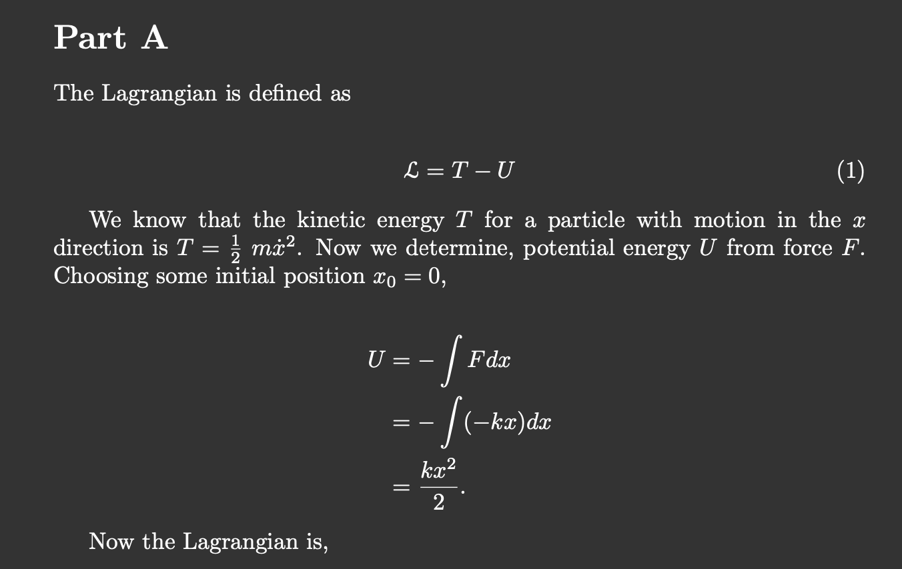

# My Physics Textbook Solutions

These are my solutions to various physics texts. For more about me, [visit my website](https://coltonkawamura.github.io/coltonkawamura/)

## Demo

I made the soutions in LaTeX in a "dark mode" color scheme. Here's an example:

## Textbook Solutions

[Griffiths Electrodynamics Fourth Eddition](https://github.com/ColtonKawamura/physics/tree/main/Electrodynamics%20-%20Griffiths)
## Disclaimer

Please support the amazing authors by purchasing the text. They are hallmarks of physics education and deserve to be on your bookshelf.

The actual solution may differ from my own shown here.

I warmly welcome any corrections to errors I have made!

## License

MIT
